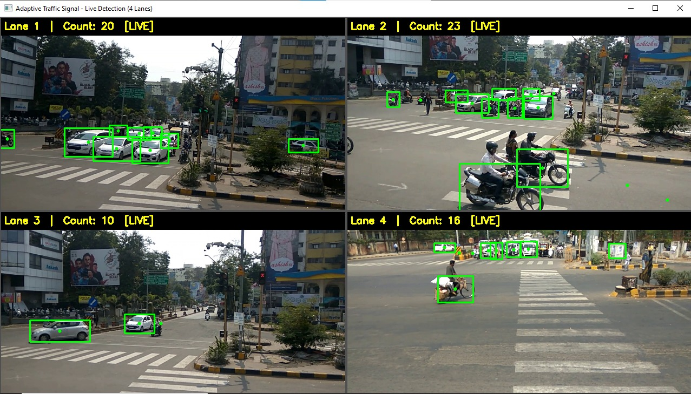
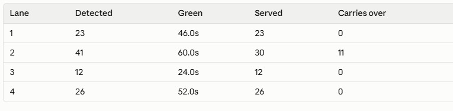
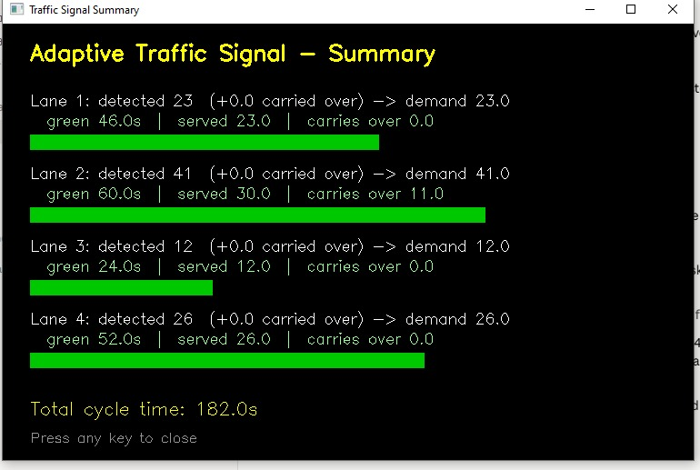
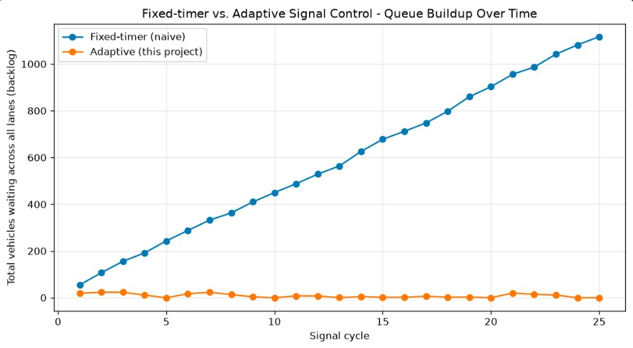

# Adaptive Traffic Signal Control Using Computer Vision

A computer-vision based traffic signal system that watches a video feed for
each lane of an intersection, detects and counts vehicles in real time, and
computes a fair, congestion-aware green-light duration for every lane.

College project: **P.E.S. College of Engineering, Dept. of Computer Science
and Engineering.** Submitted by Sandesh Bansode (49) and Syed Asimuddin (52).

---

## 1. What it does

For each of the 4 lane videos (`videos/1.mp4` .. `videos/4.mp4`):

1. Runs a **YOLOv4-tiny** object detector on every frame to find vehicles
   (car, bus, truck, motorbike, bicycle).

2. Feeds the detections into a lightweight **centroid tracker** so each
   vehicle is counted exactly once as it crosses the frame, instead of being
   re-counted on every detection.

3. Draws bounding boxes and a running vehicle count directly on the video.

4. All 4 lanes play **simultaneously in one window**, arranged as a 2x2 grid,
   so you can watch every lane detect and count vehicles at the same time.

5. Watches each tracked vehicle for a **flashing red/blue light bar** to flag
   emergency vehicles and preempt the signal for that lane.

6. Once all 4 lanes finish, it feeds the final counts (and any preemption)
   into an **adaptive signal-timing algorithm** and shows a summary screen
   with the green-light duration computed for each lane.

Two companion scripts extend this:

- **`simulate_comparison.py`** — runs a multi-cycle simulation comparing the
  adaptive algorithm with a naive fixed-timer scheme and produces a chart.

- **`dashboard.py`** — a Streamlit web dashboard that visualizes the live
  plan, vehicle-count history, backlog, and the fixed-timer-vs-adaptive
  comparison.

---

## 2. Project Demo & Results

### Live Vehicle Detection

The system processes all four lanes simultaneously using YOLOv4-tiny, with
bounding boxes and live vehicle counts displayed for each lane.



---

### Adaptive Traffic Signal Summary

After vehicle detection, the system calculates the green-light duration,
vehicles served, and carried-over demand for each lane.



---

### Lane-wise Signal Allocation

The final signal plan shows the detected vehicles, allocated green time,
vehicles served, and carry-over demand for every lane.



---

### Fixed-Timer vs. Adaptive Control

The multi-cycle simulation compares the fixed-timer approach with the
adaptive signal-control algorithm.



---

## 3. How to run it

```bash
cd "traffic project"
python detect_and_signal.py
```

A window titled **"Adaptive Traffic Signal - Live Detection (4 Lanes)"** will
open showing all 4 lanes at once with live bounding boxes and vehicle counts.

### Controls

Click the detection window first so it has focus.

| Key | Action |
|-----|--------|
| `q` | Quit / stop early |
| `p` | Pause |
| any key | Close the final summary screen |

When it finishes you'll see console output like:

```text
Lane 1: 23 vehicles detected
Lane 2: 41 vehicles detected
Lane 3: 12 vehicles detected
Lane 4: 26 vehicles detected

Saved smooth annotated video to:
.../outputs/traffic_detection_output.mp4

Vehicle counts per lane: [23, 41, 12, 26]

Lane 1: demand=23.0 green=46.0s served=23.0 carries_over=0.0
Lane 2: demand=41.0 green=60.0s served=30.0 carries_over=11.0
Lane 3: demand=12.0 green=24.0s served=12.0 carries_over=0.0
Lane 4: demand=26.0 green=52.0s served=26.0 carries_over=0.0

Total cycle time: 182.0s
```

This is followed by a **"Traffic Signal Summary"** window showing the
computed green times.

---

### Requirements

Already covered if you have Python 3.12+ with:

```text
opencv-python
numpy
scipy
matplotlib
streamlit
pandas
eclipse-sumo
traci
sumolib
```

`eclipse-sumo` is only needed for the SUMO simulation module.

No TensorFlow, PyTorch, or `dlib` needed — detection runs entirely through
OpenCV's built-in `cv2.dnn` module.

The YOLOv4-tiny model files live in `models/`:

```text
models/
├── yolov4-tiny.cfg
├── yolov4-tiny.weights
└── coco.names
```

---

### Running the extras

#### Multi-cycle comparison

Prove the adaptive algorithm's behavior over many simulated signal cycles:

```bash
python simulate_comparison.py
```

#### Live dashboard

Run:

```bash
streamlit run dashboard.py
```

Run `detect_and_signal.py` and ideally `simulate_comparison.py` at least once
before opening the dashboard, otherwise some dashboard panels may be missing.

The dashboard has a manual **"Refresh now"** button. Re-run a script and then
refresh the dashboard.

---

## 4. The Adaptive Signal Algorithm

The old approach sorted counts into fixed buckets:

```text
<25 vehicles  -> 30s
25-40         -> 60s
>40 vehicles  -> 120s
```

This throws away information — a lane with 26 vehicles and one with 39 got
treated identically, while a very congested lane could potentially receive
too much green time.

Instead, `detect_and_signal.py` uses a **saturation-flow model with
carry-over**.

### Algorithm

1. **Saturation rate**

   Each lane is assumed to clear about 1 vehicle every 2 seconds of green:

   ```text
   SATURATION_RATE = 0.5 vehicles/sec
   ```

2. **Demand**

   A lane's demand is the real number of vehicles:

   ```text
   demand = live_count + carried_over_backlog
   ```

   Demand is not artificially inflated.

3. **Green time**

   Green time is calculated as:

   ```text
   green = clamp(
       demand / saturation_rate,
       MIN_GREEN,
       MAX_GREEN
   )
   ```

   The default limits are:

   ```text
   MIN_GREEN = 10 seconds
   MAX_GREEN = 60 seconds
   ```

4. **Serve vs. carry-over**

   Vehicles actually cleared during the cycle are:

   ```text
   served = green × saturation_rate
   ```

   Any vehicles beyond the available capacity become backlog and are carried
   into the next cycle.

   For example:

   ```text
   45 vehicles
   60 seconds green
   0.5 vehicles/second

   Capacity = 60 × 0.5
            = 30 vehicles

   Carried over = 45 - 30
                = 15 vehicles
   ```

5. **Aging / anti-starvation**

   A lane that remains backlogged receives an increased green-time cap for
   every consecutive cycle it remains backlogged.

   ```text
   CAP_ESCALATION_STEP = 15s
   ABSOLUTE_MAX_GREEN = 120s
   ```

   The cap resets to the 60-second baseline once the lane fully clears.

This prevents a heavily congested lane from being permanently restricted by
a fixed green-time ceiling.

### Example

Lane 2 from the demonstration:

```text
Detected vehicles : 41
Green time        : 60 seconds
Vehicles served   : 30
Carried over      : 11
```

The 11 vehicles are carried into the next cycle's demand.

---

### Important Algorithm Design Lesson

The first version of the algorithm attempted to fix starvation by multiplying
the carried-over backlog:

```text
demand = count + backlog × 1.5
```

This was incorrect because backlog represents a real vehicle count.
Multiplying it every cycle causes the value to compound geometrically.

The simulation exposed the problem: after several cycles, the adaptive
backlog became extremely large.

The corrected approach keeps demand as the real vehicle count and instead
increases the green-time cap gradually for lanes that remain backlogged.

This produces a bounded and convergent approach while still giving priority
to lanes that have been waiting.

---

### Tunable Constants

The main tunable constants are located at the top of
`detect_and_signal.py`.

| Constant | Meaning |
|---|---|
| `SATURATION_RATE` | Vehicles cleared per second of green |
| `MIN_GREEN` / `MAX_GREEN` | Minimum and baseline maximum green time |
| `CAP_ESCALATION_STEP` | Green-time cap increase per backlogged cycle |
| `ABSOLUTE_MAX_GREEN` | Maximum possible green-time cap |
| `EMERGENCY_MIN_GREEN` | Minimum green during emergency preemption |
| `CONFIDENCE_THRESHOLD` | Minimum detector confidence |
| `DETECT_EVERY_N_FRAMES` | Detection interval |
| `INPUT_SIZE` | YOLO network input resolution |

---

## 5. Emergency Vehicle Preemption

COCO, which YOLOv4-tiny is trained on, does not have dedicated
`ambulance` or `fire truck` classes.

Instead, `emergency.py` looks for a flashing red/blue light bar.

For every tracked vehicle, the system samples the dominant color in the
top portion of its bounding box.

If the color repeatedly changes between red and blue within a short rolling
window, the vehicle is flagged as an emergency vehicle.

The detected emergency vehicle is displayed with:

```text
EMERGENCY
```

and a highlighted bounding box.

When a lane has a flagged emergency vehicle, the signal planner can preempt
the normal timing and extend the lane's green phase to clear the queue.

### Important Note

This is a **heuristic**, not a trained emergency-vehicle classifier.

The four sample lane videos do not contain real emergency vehicles, so the
feature is expected to remain inactive during a normal run.

The detection logic can be tested using:

```bash
python test_emergency.py
```

---

## 6. Before/After: Fixed-Timer vs Adaptive

A single demonstration run only shows one snapshot.

`simulate_comparison.py` runs multiple simulated signal cycles using the same
traffic-demand pattern and compares two policies:

### Fixed Timer

Every lane receives:

```text
30 seconds
```

regardless of traffic demand.

### Adaptive Control

The project uses:

```text
Saturation flow
+
Carry-over backlog
+
Aging / anti-starvation
```

Run the comparison:

```bash
python simulate_comparison.py
```

The simulation produces:

```text
outputs/comparison_chart.png
outputs/comparison.json
```

The sample simulation reported:

```text
Fixed-timer:
Average queued vehicles/cycle = 587.4
Final backlog                 = 1117.0

Adaptive:
Average queued vehicles/cycle = 8.7
Final backlog                 = 0.0
```

The sample simulation reported an average queue reduction of approximately
98.5% under the tested conditions.

The comparison chart is shown below:


> **Important:** These figures come from the project's simulation setup and
> should be interpreted as results for the tested scenario, not as a
> guarantee of the same improvement in real-world traffic.

---

## 7. Live Dashboard

Run:

```bash
streamlit run dashboard.py
```

The dashboard displays:

- Current signal plan per lane
- Green time
- Vehicles served
- Carried-over vehicles
- Cycles waited
- Emergency status
- Vehicle count history
- Persisted backlog
- Fixed-timer vs adaptive comparison
- Simulation metrics

The dashboard reads data generated by the detection and simulation scripts.

It does not run vehicle detection itself.

---

## 8. SUMO Simulation

The project also includes a SUMO microsimulation module for validating the
signal-control algorithm using an independent traffic simulator.

The SUMO module uses the same:

```text
compute_signal_plan()
```

from `detect_and_signal.py`.

Run:

```bash
python sumo_sim/generate_routes.py
python sumo_sim/traci_control.py --mode both
python sumo_sim/traci_control.py --mode adaptive --gui
```

### What's simulated

The simulation contains:

- A 4-arm intersection
- One lane per direction
- A custom 4-phase traffic light
- Fixed-timer control
- Adaptive signal control
- TraCI-based queue measurement

The fixed and adaptive simulations use identical traffic demand so their
results can be compared under the same conditions.

### Sample Result

The latest measured sample result was:

```text
Fixed:
completed_trips = 702
avg_waiting_time = 131.6s
avg_duration = 256.3s
avg_time_loss = 166.5s

Adaptive:
completed_trips = 702
avg_waiting_time = 53.4s
avg_duration = 165.7s
avg_time_loss = 75.9s
```

The sample SUMO simulation reported a reduction of approximately 59.4% in
average waiting time under the adaptive policy.

Results are saved to:

```text
outputs/sumo_comparison.json
outputs/sumo_tripinfo_fixed.xml
outputs/sumo_tripinfo_adaptive.xml
```

### Calibration Note

The first simulation attempt used unrealistic traffic volumes and short
approach roads, which caused physical gridlock independent of the signal
policy.

The simulation was subsequently adjusted to use longer approach roads and
more realistic traffic volumes to provide a more meaningful comparison.

---

## 9. Output Files

| File | Description |
|---|---|
| `out.txt` | Final vehicle count per lane from the last run |
| `signal_state.json` | Persisted backlog and cycles-waited state |
| `outputs/traffic_detection_output.mp4` | Full 2x2 annotated detection video |
| `outputs/telemetry.csv` | Per-frame vehicle count and emergency status |
| `outputs/latest_run.json` | Full signal plan from the latest run |
| `outputs/comparison_chart.png` | Fixed-timer vs adaptive comparison chart |
| `outputs/comparison.json` | Raw comparison results |
| `outputs/sumo_comparison.json` | SUMO fixed vs adaptive results |
| `outputs/sumo_tripinfo_fixed.xml` | SUMO fixed-policy trip records |
| `outputs/sumo_tripinfo_adaptive.xml` | SUMO adaptive-policy trip records |

---

## 10. Project Structure

```text
traffic project/
│
├── README.md
│
├── images/
│   ├── live-detection.jpg
│   ├── signal-summary.jpg
│   ├── signal-results.jpg
│   └── comparison-chart.jpg
│
├── detect_and_signal.py
│
├── emergency.py
│
├── test_emergency.py
│
├── simulate_comparison.py
│
├── dashboard.py
│
├── sumo_sim/
│   ├── intersection.nod.xml
│   ├── intersection.edg.xml
│   ├── intersection.con.xml
│   ├── intersection.net.xml
│   ├── intersection.sumocfg
│   ├── generate_routes.py
│   ├── routes.rou.xml
│   └── traci_control.py
│
├── tracking/
│   ├── centroidtracker.py
│   └── trackableobject.py
│
├── models/
│   ├── yolov4-tiny.cfg
│   ├── yolov4-tiny.weights
│   └── coco.names
│
├── videos/
│   ├── 1.mp4
│   ├── 2.mp4
│   ├── 3.mp4
│   └── 4.mp4
│
├── outputs/
│
├── out.txt
│
├── signal_state.json
│
└── requirements.txt
```

---

## 11. Legacy Pipeline

The repository originally contained an older pipeline using:

```text
YOLOv3
TensorFlow 2.1
Tensornets
dlib
```

That pipeline is kept for reference but is not required by the current
implementation.

The current implementation uses:

```text
YOLOv4-tiny
OpenCV DNN
Centroid Tracker
```

This avoids the older TensorFlow and dlib dependencies and allows the main
pipeline to work with modern Python versions.

Legacy files include:

```text
multithreading.py
program.py
run.sh
requirements-python-3.7.4.txt
```

These files are retained for reference and are not part of the main execution
pipeline.

---

## 12. Background: College Project Brief

### Problem Statement

Traditional traffic signals use fixed timings and cannot adapt to changing
traffic conditions, which can result in congestion, long queues, and
unnecessary waiting.

This project uses computer vision to analyze:

- Vehicle count
- Lane density
- Queue demand
- Emergency vehicles

and dynamically adjusts signal timings.

### Planned Modules

| # | Module | Status |
|---|---|---|
| 1 | Vehicle Detection (YOLO) | Implemented |
| 2 | Traffic Analysis | Implemented |
| 3 | Emergency Vehicle Detection | Implemented |
| 4 | Signal Optimization | Implemented |
| 5 | Traffic Simulation (SUMO) | Implemented |

### Target Users

- Traffic management authorities
- Smart-city systems
- Transportation planners

### Technology Stack

```text
Python
YOLOv4-tiny
OpenCV
Streamlit
SUMO
TraCI
NumPy
SciPy
Matplotlib
Pandas
```

---

## Project Highlights

- Real-time vehicle detection
- Four-lane simultaneous processing
- YOLOv4-tiny object detection
- Centroid-based vehicle tracking
- Adaptive green-light allocation
- Carry-over traffic demand
- Anti-starvation / aging mechanism
- Emergency vehicle preemption
- Multi-cycle simulation
- Fixed-timer vs adaptive comparison
- SUMO traffic simulation
- Streamlit monitoring dashboard

---

## License

Copyright (c) 2026 Sandesh Bansode. All Rights Reserved.

This repository is publicly available for viewing and evaluation purposes.

No permission is granted to copy, reproduce, redistribute, modify,
commercially exploit, or create derivative works from the original source
code without prior written permission from the copyright holder.

Third-party libraries, models, datasets, frameworks, and other external
materials remain subject to their respective licenses.